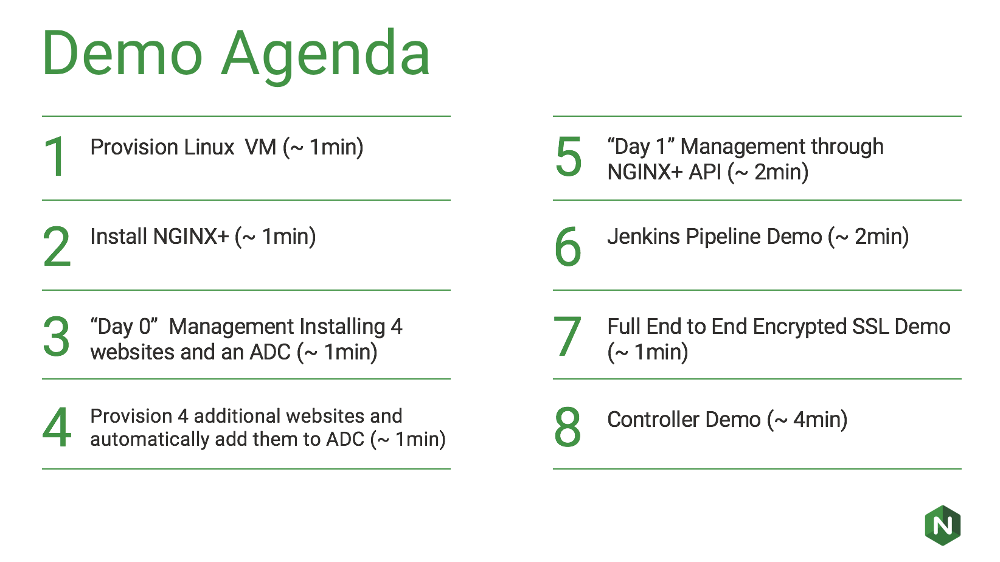
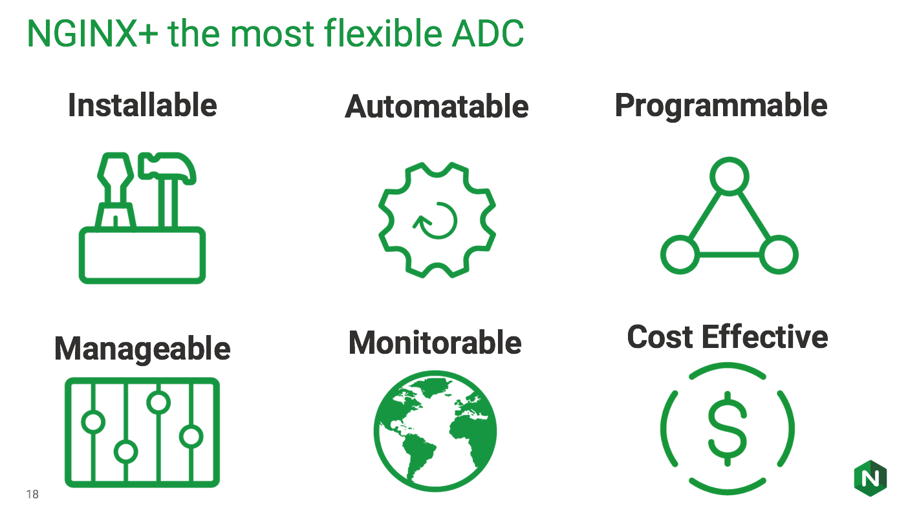

# NGINX+ Ansible Demo - Layer 7 Services as Code (L7aC)

[](https://www.nginx.com/products/nginx/ "NGINX+")

## NGINX is the most flexible ADC 
[](https://www.nginx.com/products/nginx/ "NGINX+")


## Layer 7 Services as Code (L7aC) -  Principles, Practices and Patterns
[Layer 7 Services as Code (L7aC) -  Benefits](docs/L7AC.md)

## Installing Ansible

[Installing Ansible on a Mac Documentation](docs/INSTALL.md)

## Demo Uses Vagrant

[Vagrantfile for a CentOS 7 Image](vagrant/Vagrantfile)

## YAML Syntax Overview

[YAML Syntax Overview](https://learn.getgrav.org/advanced/yaml)


## Useful vimrc macro for editing YaML files
```
autocmd FileType yaml setlocal ai ts=2 sw=2 et colorcolumn=1,3,5,7,9,11,13 nu
```
### To turn off colorized lines
```
set cc=
```


## Running the Ansible Code

```
(ansible)$ ansible-playbook playbooks/install.yml --private-key ~/Dropbox/Ansible_Playbook/.vagrant/machines/default/virtualbox/private_key -u vagrant
```

## Ansible Variable Precedence

[Ansible 2.x Order of Variable Precedence](docs/PRECEDENCE.md)


## Ansible Roles
This ansible repository is organized into roles. Roles are collections of templates, files, tasks,
and variables. Tasks are organized based on the particular module they are implementing. 

## License
### Apache V2.0

Licensed under the Apache License, Version 2.0 (the "License"); you may not use this file except in compliance with the License. You may obtain a copy of the License at

http://www.apache.org/licenses/LICENSE-2.0

Unless required by applicable law or agreed to in writing, software distributed under the License is distributed on an "AS IS" BASIS, WITHOUT WARRANTIES OR CONDITIONS OF ANY KIND, either express or implied. See the License for the specific language governing permissions and limitations under the License.
